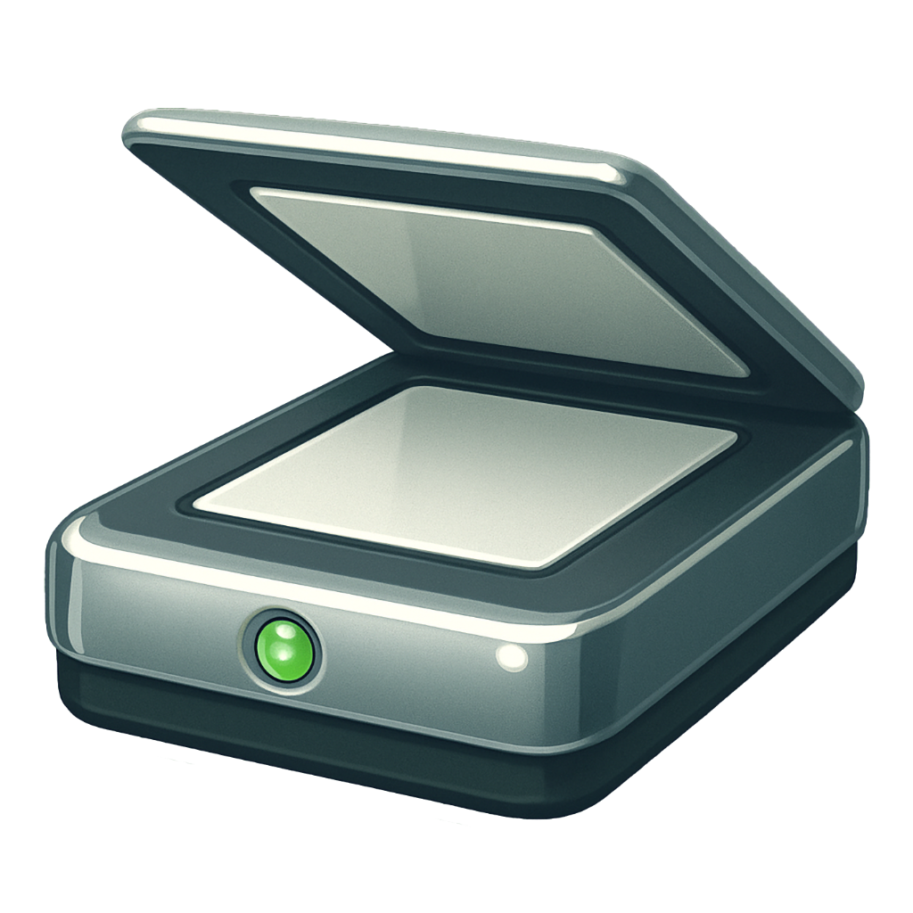

# Photocopy

  
  
  **A modern clipboard manager for macOS**
  
  *Keep track of everything you copy with a beautiful, accessible interface*

## ✨ Features

### 🎯 Core Functionality
- **Global Hotkey**: Press `⌘⇧V` to instantly access your clipboard history
- **Smart Monitoring**: Automatically captures everything you copy to the clipboard
- **Multi-Content Support**: Text, images, files, and URLs with proper previews
- **Horizontal Overlay**: Beautiful bottom-screen interface that doesn't interrupt your workflow

### 🔍 Advanced Features
- **Search & Filter**: Quickly find items in your clipboard history
- **Content Type Filtering**: Filter by text, images, files, or URLs
- **Menu Bar Integration**: Quick access from the menu bar
- **Privacy Controls**: Exclude sensitive apps and content types

### 🎨 User Experience
- **Modern UI**: Clean, intuitive interface with dark/light mode support
- **Smooth Animations**: Polished transitions and visual feedback
- **Keyboard Navigation**: Full keyboard support with arrow keys and shortcuts
- **Visual Previews**: Thumbnails for images, icons for files, formatted text previews

### ⚙️ Customization
- **History Management**: Configure how many items to keep (10-1000)
- **Content Filtering**: Choose which content types to monitor
- **App Exclusions**: Exclude specific apps from clipboard monitoring
- **Launch at Login**: Automatically start with your system

## 🚀 Installation

### Requirements
- macOS 13.0 (Ventura) or later
- Accessibility permissions (for global hotkeys and clipboard monitoring)

### Setup
1. **Download** the latest release from the releases page
2. **Move** Photocopy.app to your Applications folder
3. **Launch** the app - it will appear in your menu bar
4. **Grant Permissions** when prompted:
   - Accessibility permissions for global hotkeys
   - Apple Events permissions for paste functionality

### First Launch
On first launch, Photocopy will:
- Show a brief onboarding guide
- Request necessary system permissions
- Add itself to your menu bar
- Begin monitoring your clipboard

## 📖 Usage

### Basic Usage
1. **Copy anything** as you normally would (`⌘C`)
2. **Press `⌘⇧V`** to open the clipboard history overlay
3. **Navigate** with arrow keys or mouse
4. **Select an item** by clicking or pressing Enter
5. **Press Escape** to close without pasting

### Keyboard Shortcuts
- `⌘⇧V` - Open clipboard history overlay
- `↑/↓` or `←/→` - Navigate through items
- `Enter` - Paste selected item
- `Delete` - Remove selected item from history
- `Escape` - Close overlay
- `⌘F` - Focus search field (when overlay is open)

### Menu Bar Features
- **Recent Items**: Quick access to your last few clipboard items
- **Search History**: Open the main interface with search
- **Clear History**: Remove all clipboard items
- **Settings**: Configure app preferences
- **Quit**: Exit the application

### Search & Filtering
- **Text Search**: Type to search through clipboard content
- **Content Filters**: Use the filter buttons to show only specific types
- **Smart Matching**: Searches through text content, file names, and URLs

## ⚙️ Settings

### General
- **Launch at Login**: Automatically start Photocopy when you log in
- **History Limit**: Set how many items to keep (10-1000)
- **Show Menu Bar Icon**: Toggle menu bar visibility

### Content Types
- **Monitor Text**: Capture text content
- **Monitor Images**: Capture image content
- **Monitor Files**: Capture file paths and metadata
- **Monitor URLs**: Capture web links

### Privacy
- **Excluded Apps**: Prevent specific apps from being monitored
- **Sensitive Content Filtering**: Automatically exclude passwords and credit cards
- **Clear History**: Remove all stored clipboard items

### Advanced
- **Content Size Limits**: Configure maximum sizes for different content types
- **Cleanup Settings**: Automatic removal of old items

## 🔒 Privacy & Security

Photocopy takes your privacy seriously:

- **Local Storage Only**: All clipboard data is stored locally on your Mac
- **No Network Access**: The app doesn't connect to the internet
- **Sensitive Content Detection**: Automatically excludes passwords and credit card numbers
- **App Exclusions**: Exclude password managers and other sensitive apps
- **Sandboxed**: Runs in a secure sandbox environment

## 🛠️ Technical Details

- **Built with**: SwiftUI and SwiftData
- **Platform**: macOS 13.0+
- **Architecture**: Native Swift application
- **Storage**: Local SQLite database via SwiftData
- **Permissions**: Accessibility (for global hotkeys), Apple Events (for pasting)

## 🐛 Troubleshooting

### Common Issues

**Hotkey not working?**
- Check that Accessibility permissions are granted in System Settings > Privacy & Security > Accessibility
- Restart the app after granting permissions

**App not capturing clipboard?**
- Ensure Photocopy is running (check menu bar)
- Verify that the source app isn't in your excluded apps list
- Check that the content type is enabled in settings

**Paste not working?**
- Grant Apple Events permissions when prompted
- Check that the target app accepts the clipboard content type

### Getting Help
If you encounter issues:
1. Check the settings to ensure proper configuration
2. Restart the app from the menu bar
3. Check macOS permissions in System Settings
4. Create an issue on GitHub with details about your problem

## 📝 License

Copyright © 2025 Rafael Costa. All rights reserved.

---

  Made with ❤️ for macOS users who copy a lot of things

 